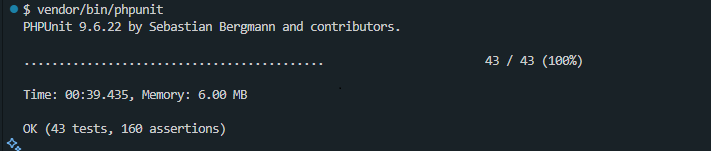

# Running Tests

1. Open the project directory:

   `cd path/to/solvecaptcha-php`

2. Install dependencies:

   `composer install`

3. Run the tests using PHPUnit:

   `vendor/bin/phpunit`

   Expected result:

   